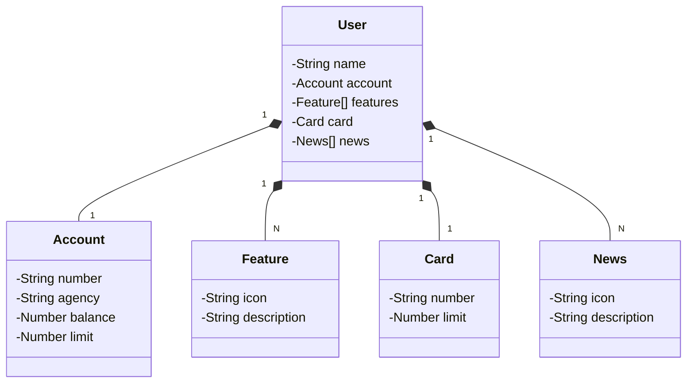

 # API REST com Java 17 e Spring Boot 3

📌 Sobre o Projeto

Este projeto tem como objetivo a construção de uma API REST do zero utilizando Java 17 e Spring Boot 3. A API permitirá operações em um banco de dados SQL utilizando Spring Data JPA e contará com uma documentação interativa através do OpenAPI (Swagger). Para o deploy na nuvem, utilizaremos o Railway, tornando o processo simples e eficiente.

## ⚙️ Tecnologias Utilizadas

🔹 Java 17 → Linguagem de programação utilizada no projeto.

🔹 Spring Boot 3 → Framework que facilita a configuração e desenvolvimento de aplicações Java.

🔹 Spring Data JPA → Simplifica a interação com bancos de dados SQL.

🔹 OpenAPI (Swagger) → Documentação interativa para a API.

🔹 Railway → Plataforma para deploy na nuvem.

## ▶️ Como Executar o Projeto

### 📌 Pré-requisitos

Antes de iniciar, certifique-se de ter instalado:

🔹Java 17

🔹Maven

🔹Docker (opcional, caso queira rodar o banco de dados localmente)

## 🖥️ Passos para rodar o projeto

**1️⃣ Clone o repositório:**
```
git clone https://github.com/seu-usuario/nome-do-projeto.git
```
**2️⃣ Acesse o diretório do projeto:**
```
cd nome-do-projeto
```
**3️⃣ Configure o banco de dados (caso utilize PostgreSQL via Docker):**
```
docker run --name meu-banco -e POSTGRES_USER=usuario -e POSTGRES_PASSWORD=senha -e POSTGRES_DB=meubanco -p 5432:5432 -d postgres
```
**4️⃣ Configure as variáveis de ambiente no arquivo .env ou application.properties:**
```
spring.datasource.url=jdbc:postgresql://localhost:5432/meubanco
spring.datasource.username=usuario
spring.datasource.password=senha
spring.jpa.hibernate.ddl-auto=update
```
**5️⃣ Compile e execute a aplicação:**
```
mvn spring-boot:run
```
**6️⃣ Acesse a API no navegador:**
```
http://localhost:8080
```
**7️⃣ Acesse a documentação Swagger:**
```
http://localhost:8080/swagger-ui.html
```

## 📚 Endpoints Principais

###🔹 Exemplo de Endpoint - Criar um Recurso
```
POST /api/recurso
```

**Body (JSON):**
```
{
  "nome": "Exemplo",
  "descricao": "Descrição do recurso"
}
```
### 🔹 Exemplo de Endpoint - Listar Recursos
```
GET /api/recurso
```

## 🚀 Deploy na Railway

1️⃣ Faça login na Railway

2️⃣ Crie um novo projeto e conecte o repositório do GitHub

3️⃣ Configure as variáveis de ambiente conforme necessário

4️⃣ Execute o deploy e obtenha a URL pública da API

## Diagrama de Classes




### 🤝 Contribuição

Contribuições são bem-vindas! Caso encontre problemas ou tenha sugestões, abra uma issue ou envie um pull request.
