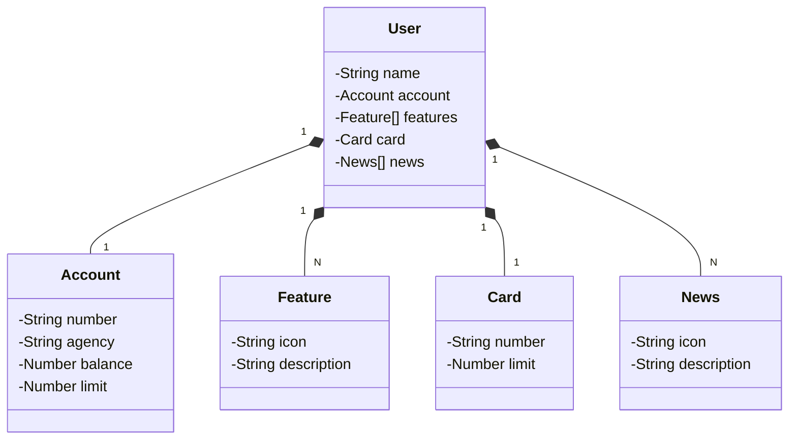

# Decola Tech 2025

## Principais Tecnologias

### Java 17
--> Utilizado a versão de Long-Term Support (LTS) do Java 17, que traz diversas novidades e melhorias de desempenho, segurança e produtividade.

### Spring Boot 3
--> O Spring Boot 3 foi escolhido para acelerar o desenvolvimento, graças à sua capacidade de autoconfiguração, que reduz a necessidade de configurações manuais e permite um foco maior na lógica de negócios.

--> O Spring Boot facilita a criação de aplicações robustas e escaláveis com menos código boilerplate.

### Spring Data JPA
--> Utilizamos o Spring Data JPA para simplificar o acesso e a manipulação de dados em bancos de dados SQL. Com ele, é possível criar repositórios de forma declarativa, reduzindo a complexidade do código de acesso a dados.

### OpenAPI (Swagger)
--> Para garantir uma documentação clara e robusta da API, utilizamos o OpenAPI (Swagger). Ele permite que a documentação seja gerada automaticamente e facilita a compreensão e o uso da API por outros desenvolvedores.

### Railway
--> O Railway foi escolhido para simplificar o processo de deploy da aplicação na nuvem. Com ele, é possível realizar deploys rápidos e eficientes, garantindo que a aplicação esteja sempre disponível e escalável.

## Diagrama de Classes

